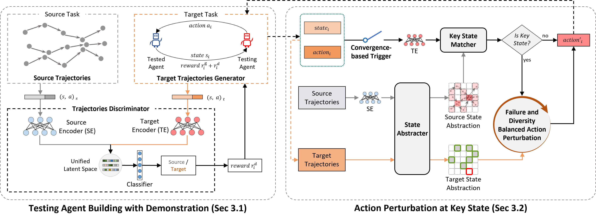
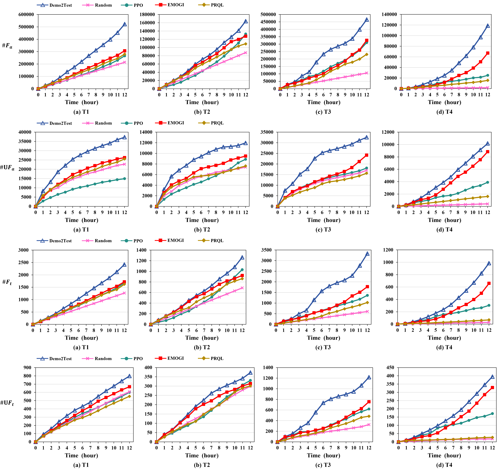

# <font size=6>Demo2Test</font>
This repository contains the source code for the paper **Demo2Test: Transfer Testing of Adversarial Agent from Failure Demonstrations**.

# Overview

We propose Demo2Test for conducting transfer testing of adversarial agents in competitive games, i.e., leveraging the demonstrations of failure scenarios from the source task to boost the testing effectiveness in the target task.

Experimental evaluation on effectiveness of Demo2Test  on four transfer settings in the competitive game environment of MuJoCo with promising performance, outperforming four baselines.

The overview of Demo2Test is shown in the figure below:


# Environment Setup
## Required Environment 
we use [Sacred](https://github.com/IDSIA/sacred) for experiment configuration.

This codebase uses Python 3.7. The main binary dependencies are MuJoCo (version 1.3.1, for `gym_compete` environments).

The competitive environment (`gym_compete`) and agent model we test is provided from this awesome repository: https://github.com/openai/multiagent-competition
## Installation instructions
Install the required the packages inside the virtual environment:
```
$ conda create -n yourenvname python=3.7 anaconda
$ source activate yourenvname
$ conda install cudatoolkit==9.2
$ pip install -r requirements.txt
```
Main requirements:

```shell
gym[mujoco]==0.15.4
mujoco-py-131 @ git+https://github.com/AdamGleave/mujoco-py.git@mj131
gym_compete @ git+https://github.com/HumanCompatibleAI/multiagent-competition.git@3a3f9dc
```

# Running
**Run an experiment**

To test in the game of 'SumoAnts', using the source demonstrations in 'data/trajectories/RunToGoalAnts_source_traj.npz':
```shell
python -m aprl.train_demo2Test with game_name=SumoAnts-v0 expert_dataset_path=data/trajectories/RunToGoalAnts_source_traj.npz
```
The all config parameters are shown in train_demo2test.py.

You can test other game in `gym_compete` and using the official Agent Zoo to generate simulated source demonstrations.
The data format refers to the example of 'data/trajectories/RunToGoalAnts_source_traj.npz'.

# Trend Graph Results
The trend of number and unique number of failure scenarios found by Demo2Test and baselines:

Results show that in each time duration, Demo2Test outperforms all four baselines, whether considering the terminating state of the fault scenario or all states.

The transfer settings from T1 to T4 and the presentation of each baseline can be found in our paper.

# Reference
- https://github.com/HumanCompatibleAI/adversarial-policies/
- https://github.com/openai/multiagent-competition/
- https://github.com/Khrylx/PyTorch-RL/